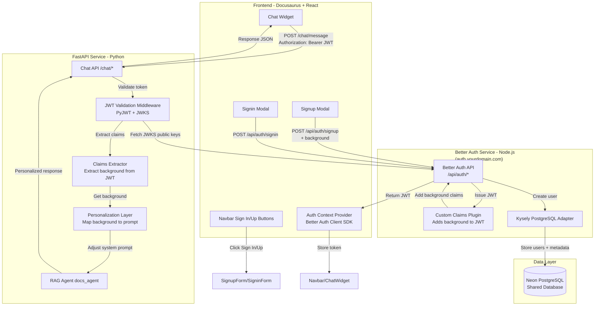
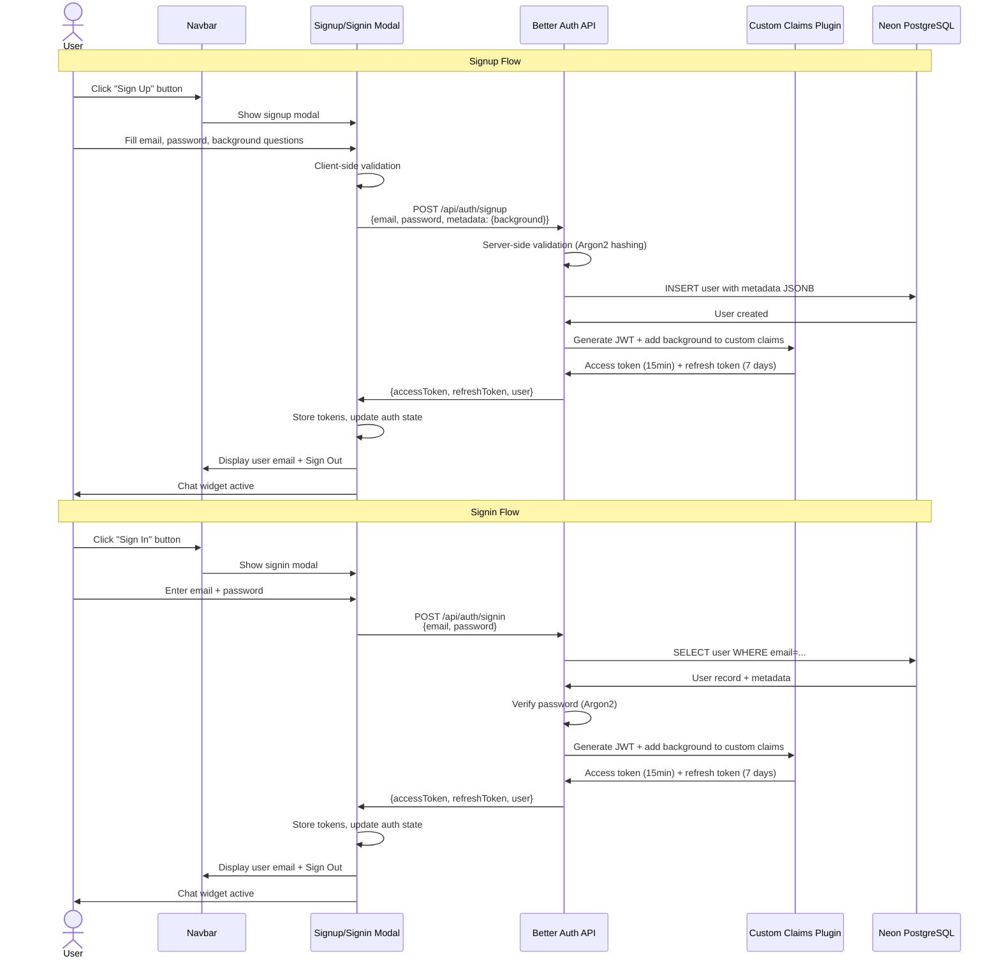
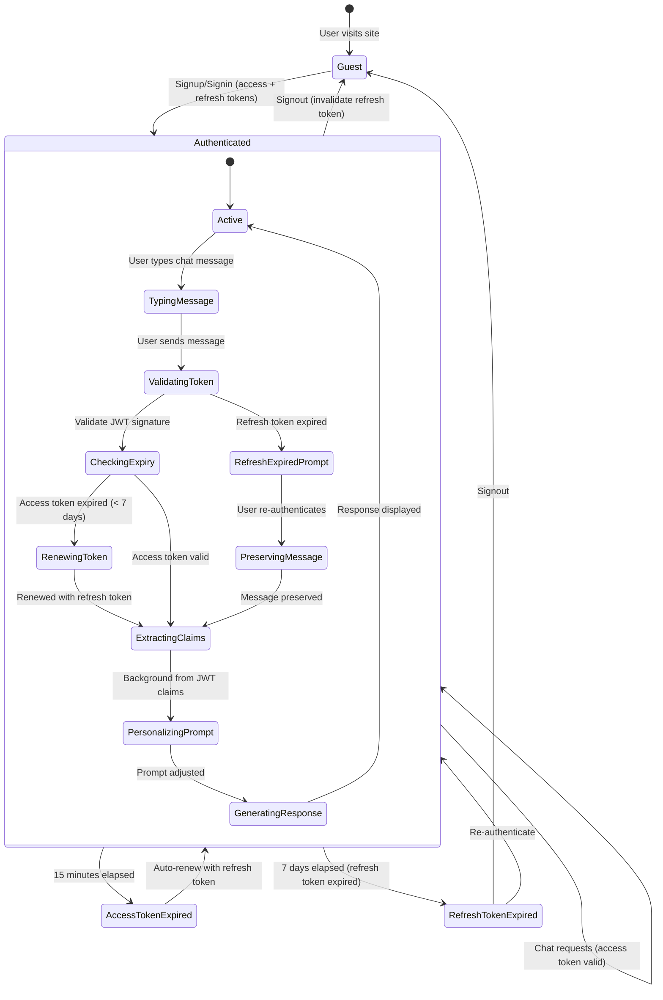
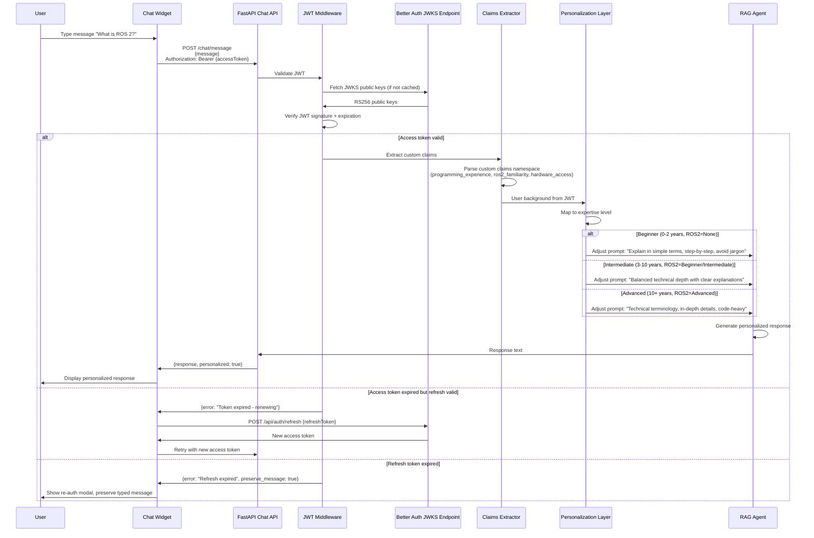

# Implementation Plan: RAG Chatbot Authentication with Better Auth

**Branch**: `authentication` | **Date**: 2025-12-17 | **Updated**: 2025-12-25 (Better Auth Microservice Architecture) | **Spec**: [spec.md](./spec.md)
**Input**: Feature specification from `/specs/authentication/spec.md`

## Integration Update (2025-12-25)

**Main Branch Status**: Now includes redesigned navbar with Sign In/Sign Up buttons (dummy placeholders).

**Integration Changes**:
- Auth entry point changed from ChatWidget to **Navbar** (`physical-robotics-ai-book/src/theme/Navbar/index.tsx`)
- Auth forms display as modals when navbar buttons clicked
- Authenticated state shows user email + Sign Out in navbar (using `Navbar/Content/index.tsx` from auth branch)
- Frontend structure updated to reflect Navbar integration instead of ChatWidget modification

## Architectural Decision

**Original Requirement**: Better Auth
**Implementation**: Better Auth as separate Node.js microservice + FastAPI for RAG chatbot

**Rationale**: After analysis via Better Auth MCP server, confirmed that Better Auth CAN be used with FastAPI through a **microservices architecture**. Better Auth runs as a standalone Node.js authentication service, while FastAPI consumes it via JWT validation. This provides:

1. **Meets original requirement**: Uses Better Auth as specified
2. **Modern microservices pattern**: Each service has single responsibility (auth vs. chatbot)
3. **Better Auth advantages**:
   - Native Neon PostgreSQL support (Kysely adapter)
   - Built-in JWT with custom claims for user background
   - REST API endpoints (`/api/auth/*`)
   - Production-ready session management with refresh tokens
   - Secure password hashing (Argon2)
4. **FastAPI integration**: Validates JWT tokens using Better Auth's JWKS endpoint (RS256), extracts user profile from JWT custom claims

## Summary

Implement user authentication for the RAG chatbot using **Better Auth microservice** with custom background profiling (programming experience, ROS 2 familiarity, hardware access) to personalize chatbot responses. Better Auth runs as separate Node.js service, FastAPI validates JWT tokens and personalizes RAG responses. Deploy both services on Render free tier with shared Neon PostgreSQL.

**Core Flow**: User signs up → Better Auth collects background → Stores in metadata + JWT claims → User chats with JWT → FastAPI validates token → Extracts background from JWT → RAG agent system prompt dynamically adjusted → Personalized response generated

## Technical Context

**Language/Version**:
- Better Auth Service: Node.js 18+ LTS, TypeScript
- FastAPI Service: Python 3.10+
- Frontend: JavaScript/TypeScript (React 18+ with Docusaurus 3.x)

**Primary Dependencies**:
- Better Auth Service: Better Auth library, Kysely (PostgreSQL adapter), Node.js runtime
- FastAPI Service: FastAPI 0.100+, PyJWT[crypto] (RS256 validation), httpx (JWKS fetching), uv (package manager)
- Frontend: React 18+, Docusaurus 3.x, Better Auth client SDK

**Storage**: Neon PostgreSQL (shared between Better Auth and FastAPI via DATABASE_URL from .env)
**Testing**: pytest (FastAPI), Jest (Better Auth + React frontend)
**Target Platform**: Render free tier (two separate web services: Better Auth + FastAPI), GitHub Pages (frontend static site)
**Project Type**: Microservices architecture (Better Auth auth service + FastAPI RAG service + Docusaurus frontend)
**Performance Goals**:
- Signup/signin < 2 seconds
- Background data retrieval < 500ms
- Session validation < 100ms overhead
- Chat response (including personalization) < 5 seconds

**Constraints**:
- Better Auth default password validation with Argon2 hashing
- Neon PostgreSQL free tier (connection pooling required, shared across both services)
- Render free tier deployment (two separate web services with distinct URLs)
- CORS configuration required (production domain + subdomains: *.yourdomain.com)
- No modifications to existing RAG agent core logic
- Preserve existing Docusaurus documentation functionality

**Scale/Scope**:
- Expected users: 100-1000 concurrent sessions
- Database: <1GB storage (free tier limit, shared by both services)
- Access token duration: 15 minutes (auto-renewed via refresh token)
- Refresh token duration: 7 days (weekly re-authentication required)
- Background profile: 3 fields per user (stored in JSONB metadata + JWT custom claims)

## Constitution Check

*GATE: Must pass before Phase 0 research. Re-check after Phase 1 design.*

### ✅ I. Educational Clarity
**Status**: PASS
**Assessment**: Authentication is a prerequisite for personalized chatbot learning experience. Clear progression: guest → signup → personalized chat.

### ✅ II. Engineering Accuracy
**Status**: PASS
**Assessment**: Better Auth is production-grade authentication library with Node.js runtime. PyJWT is industry-standard for JWT validation in Python. Neon PostgreSQL is production-grade database. FastAPI + Docusaurus are well-validated frameworks. Microservices pattern is well-established architectural approach.

### ✅ III. Practical Applicability (NON-NEGOTIABLE)
**Status**: PASS
**Assessment**: Fully executable - Better Auth provides runnable Node.js service, FastAPI backend operational with PyJWT validation, Docusaurus frontend functional with Better Auth client SDK. All dependencies specified with versions. Render supports multiple service deployments.

### ✅ IV. Spec-Driven Development
**Status**: PASS
**Assessment**: spec.md created and clarified via `/sp.clarify`. This plan directly references spec requirements (FR-001 through FR-019).

### ✅ V. Ethical Responsibility
**Status**: PASS
**Assessment**: Password security via Better Auth Argon2 hashing, JWT session security with RS256 asymmetric signing and token rotation, no exposure of sensitive data in logs. SQL injection/XSS prevention via parameterized queries. CORS properly configured to prevent CSRF attacks.

### ✅ VI. Reproducibility & Open Knowledge
**Status**: PASS
**Assessment**: All dependencies versioned, DATABASE_URL configuration documented, deployment steps will be in quickstart.md. Repository publicly accessible.

### ✅ VII. Zero Broken State
**Status**: PASS (with monitoring)
**Assessment**: Incremental deployment strategy - authentication layer adds to existing system without breaking current functionality. CI/CD tests required before merge.

**Overall**: ✅ All constitution gates PASS. Proceed to Phase 0.

## Project Structure

### Documentation (this feature)

```text
specs/authentication/
├── spec.md              # Feature specification (COMPLETE)
├── plan.md              # This file (IN PROGRESS)
├── research.md          # Phase 0 output (TO BE CREATED)
├── data-model.md        # Phase 1 output (TO BE CREATED)
├── quickstart.md        # Phase 1 output (TO BE CREATED)
├── contracts/           # Phase 1 output (TO BE CREATED)
│   ├── auth-api.yaml   # OpenAPI spec for auth endpoints
│   └── personalization-api.yaml  # OpenAPI spec for personalization layer
└── tasks.md             # Phase 2 output (/sp.tasks command - NOT created by /sp.plan)

specs/authentication/static/diagrams/  # Architecture diagrams
├── architecture-overview.mmd          # High-level system architecture
├── authentication-flow.mmd            # Signup/signin sequence
├── session-management.mmd             # Session lifecycle
└── personalization-flow.mmd           # RAG agent personalization sequence
```

### Source Code (repository root)

```text
better-auth-service/             # NEW - Better Auth microservice (Node.js)
├── src/
│   ├── auth.ts                 # Better Auth configuration
│   ├── server.ts               # Express server for Better Auth
│   ├── plugins/
│   │   └── custom-claims.ts    # Plugin to add user background to JWT custom claims
│   └── database.ts             # Kysely PostgreSQL adapter configuration
├── tests/
│   ├── signup.test.ts
│   ├── signin.test.ts
│   └── tokens.test.ts
├── .env                        # DATABASE_URL, BETTER_AUTH_SECRET
├── package.json                # Better Auth, Kysely, Express dependencies
└── tsconfig.json               # TypeScript configuration

backend/                        # FastAPI RAG service
├── src/
│   ├── auth/                    # NEW - JWT validation layer
│   │   ├── __init__.py
│   │   ├── jwt_validator.py    # PyJWT validation against Better Auth JWKS
│   │   ├── middleware.py       # JWT validation middleware for FastAPI
│   │   └── claims_extractor.py # Extract user background from JWT custom claims
│   ├── chat/                    # MODIFIED - Add personalization layer
│   │   ├── __init__.py
│   │   ├── routes.py           # MODIFIED - Add auth check + JWT claims extraction
│   │   ├── agent.py            # MODIFIED - Add dynamic prompt adjustment
│   │   └── personalization.py  # Background-to-prompt mapping logic
│   └── config.py               # MODIFIED - Add BETTER_AUTH_JWKS_URL configuration
├── tests/
│   ├── auth/
│   │   ├── test_jwt_validation.py
│   │   ├── test_claims_extraction.py
│   │   └── test_personalization.py
│   └── integration/
│       └── test_auth_chat_flow.py
├── .env                        # DATABASE_URL, BETTER_AUTH_JWKS_URL
└── requirements.txt            # MODIFIED - Add PyJWT[crypto], httpx

frontend/                        # Docusaurus site (physical-robotics-ai-book/)
├── src/
│   ├── components/
│   │   ├── Auth/                # NEW - Auth components & modals
│   │   │   ├── AuthContext.tsx # NEW - React context for auth state (EXISTING in auth branch)
│   │   │   ├── SignupForm.tsx  # NEW - Signup modal with background questions (EXISTING in auth branch)
│   │   │   ├── SigninForm.tsx  # NEW - Signin modal (EXISTING in auth branch)
│   │   │   ├── AuthPrompt.tsx  # NEW - Guest user auth prompt for chat widget (EXISTING in auth branch)
│   │   │   ├── Auth.module.css # NEW - Styling for auth components (EXISTING in auth branch)
│   │   │   └── index.tsx       # NEW - Auth exports (EXISTING in auth branch)
│   │   ├── ChatWidget/          # MODIFIED - Check auth before allowing chat
│   │   │   └── ChatWidget.tsx  # MODIFIED - Show AuthPrompt for guests (ALREADY in auth branch)
│   └── theme/
│       ├── Navbar/              # MODIFIED - Main integration point
│       │   ├── index.tsx       # MODIFIED - Add onClick handlers for auth modals (from main branch - needs update)
│       │   ├── Content/        # Auth-aware navbar content
│       │   │   └── index.tsx   # EXISTING in auth branch - shows user email + Sign Out when authenticated
│       │   └── styles.module.css # Navbar styles from main branch
│       └── Layout/
│           └── index.tsx       # MODIFIED - Wrap with AuthProvider (EXISTING in auth branch)
├── static/
│   └── (existing static assets - no changes)
└── package.json                 # No additional deps needed (React already included)
```

**Structure Decision**: Microservices architecture (Better Auth service + FastAPI service + frontend). Better Auth service handles all authentication logic. FastAPI service validates JWT tokens and handles RAG agent personalization. Frontend provides auth UI integrated into existing Docusaurus navbar and chat widget. Minimal changes to existing codebase - authentication is additive layer with two backend services.

## Complexity Tracking

No constitution violations. This section intentionally left empty.

## Architecture

### System Architecture Overview



### Authentication Flow



### Session Management Flow



### Personalization Flow



## Phase 0: Research & Technology Validation

### Research Tasks

1. **Better Auth Setup with Neon PostgreSQL**
   - Research Question: How to configure Better Auth with Kysely adapter for Neon PostgreSQL?
   - Method: Review Better Auth MCP server docs, Kysely PostgreSQL adapter configuration
   - Output: Better Auth configuration pattern with Kysely + Neon PostgreSQL connection string

2. **Better Auth Custom Claims Plugin**
   - Research Question: How to add user background fields to JWT custom claims in Better Auth?
   - Method: Review Better Auth plugin system, custom claims examples via Better Auth MCP
   - Output: Custom claims plugin implementation for `programming_experience`, `ros2_familiarity`, `hardware_access`

3. **FastAPI JWT Validation with PyJWT**
   - Research Question: How to validate Better Auth RS256 JWT tokens in FastAPI using JWKS endpoint?
   - Method: Review PyJWT[crypto] documentation, JWKS fetching patterns, RS256 asymmetric validation
   - Output: JWT middleware implementation for FastAPI that validates tokens against Better Auth JWKS

4. **React Better Auth Client SDK Integration**
   - Research Question: How to integrate Better Auth client SDK in React + Docusaurus?
   - Method: Review Better Auth client SDK docs, React hooks patterns, token storage strategies
   - Output: React hooks pattern for auth state management with Better Auth SDK + localStorage/cookies

5. **Token Refresh Strategy in React**
   - Research Question: How to implement automatic access token renewal using refresh tokens?
   - Method: Review interceptor patterns for API calls, token refresh before expiration
   - Output: Axios/Fetch interceptor pattern for automatic token renewal (15min access, 7-day refresh)

6. **Microservices CORS Configuration**
   - Research Question: How to configure CORS for cross-origin communication between Better Auth and FastAPI services?
   - Method: Review CORS patterns for microservices, Render deployment CORS configuration
   - Output: CORS configuration for both services allowing production domain + subdomains

### Research Output: research.md

Will document:
- Better Auth configuration with Kysely + Neon PostgreSQL
- Custom claims plugin implementation for user background fields
- FastAPI PyJWT validation against Better Auth JWKS endpoint (RS256)
- React Better Auth client SDK integration pattern
- Token refresh strategy (15min access + 7-day refresh with auto-renewal)
- CORS configuration for microservices architecture
- Deployment strategy on Render (two separate services sharing Neon database)
- Why Better Auth microservice architecture was chosen over monolithic FastAPI-Users

## Phase 1: Design & Contracts

### Data Model (data-model.md)

**Entities:**

1. **User** (managed by Better Auth in Neon PostgreSQL)
   - `id` (string, PK, Better Auth user ID)
   - `email` (string, unique, indexed)
   - `emailVerified` (boolean, default: false)
   - `name` (string, optional)
   - `image` (string, optional, profile picture URL)
   - `createdAt` (timestamp)
   - `updatedAt` (timestamp)
   - `metadata` (JSONB, stores BackgroundProfile - custom field added via Better Auth schema extension)

2. **Account** (managed by Better Auth - for password storage)
   - `id` (string, PK)
   - `userId` (string, FK to User)
   - `accountId` (string, provider account ID)
   - `providerId` (string, e.g., "credential" for email/password)
   - `password` (string, Argon2 hashed - only for credential provider)
   - `accessToken` (string, optional)
   - `refreshToken` (string, optional)
   - `expiresAt` (timestamp, optional)

3. **Session** (managed by Better Auth - for refresh tokens)
   - `id` (string, PK)
   - `userId` (string, FK to User)
   - `expiresAt` (timestamp)
   - `token` (string, refresh token - rotated on use)
   - `ipAddress` (string, optional)
   - `userAgent` (string, optional)

4. **BackgroundProfile** (stored in User.metadata JSONB field)
   - `programming_experience` (string enum: "0-2 years", "3-5 years", "6-10 years", "10+ years")
   - `ros2_familiarity` (string enum: "None", "Beginner", "Intermediate", "Advanced")
   - `hardware_access` (string enum: "None", "Simulation only", "Physical robots/sensors")

5. **JWT Access Token** (stateless, not stored in database)
   - Standard claims: `sub` (user_id), `email`, `exp` (15 minutes), `iat`
   - Custom claims namespace: `https://yourdomain.com/claims`
     - `programming_experience`, `ros2_familiarity`, `hardware_access`
   - Signed with RS256 (private key managed by Better Auth)
   - Validated by FastAPI using JWKS public keys

6. **Refresh Token** (stored in Session table)
   - 7-day expiration
   - Rotated on each use (old token invalidated, new token issued)
   - Invalidated on signout

**Relationships:**
- User 1:N Account (supports multiple auth providers, we use "credential")
- User 1:N Session (multiple active sessions across devices)
- User 1:1 BackgroundProfile (embedded in metadata JSONB field)
- Access tokens are stateless (validated via JWKS, no database storage)
- Refresh tokens stored in Session table

**Validation Rules:**
- Email: RFC 5322 format validation (client + Better Auth server-side)
- Password: Better Auth default validation (minimum 8 characters + Argon2 hashing)
- Background fields: Dropdown-only values (prevents malformed input)
- JWT signature: RS256 asymmetric validation via JWKS

### API Contracts (contracts/)

#### better-auth-api.yaml (OpenAPI 3.0)

Better Auth service hosted at `auth.yourdomain.com`:

```yaml
POST /api/auth/sign-up/email
Request:
  email: string (required, format: email)
  password: string (required, Better Auth Argon2 validation)
  name: string (optional)
  metadata:
    programming_experience: enum (required: "0-2 years" | "3-5 years" | "6-10 years" | "10+ years")
    ros2_familiarity: enum (required: "None" | "Beginner" | "Intermediate" | "Advanced")
    hardware_access: enum (required: "None" | "Simulation only" | "Physical robots/sensors")
Response 200:
  user: {id, email, name, metadata}
  session: {token (refresh token), expiresAt}
  accessToken: string (JWT, 15min expiration, includes custom claims)
  refreshToken: string (7 days)
Response 400:
  error: {message: "Email already registered"}
  error: {message: "Invalid email format"}
  error: {message: "Password does not meet requirements"}
Response 500:
  error: {message: "Internal server error"}

POST /api/auth/sign-in/email
Request:
  email: string (required)
  password: string (required)
Response 200:
  user: {id, email, name, metadata}
  session: {token, expiresAt}
  accessToken: string (JWT, 15min, includes custom claims from metadata)
  refreshToken: string (7 days)
Response 401:
  error: {message: "Invalid credentials"}
Response 500:
  error: {message: "Internal server error"}

POST /api/auth/sign-out
Headers:
  Authorization: Bearer {accessToken}
Request:
  refreshToken: string (to invalidate)
Response 200:
  success: true
Response 401:
  error: {message: "Unauthorized"}

POST /api/auth/refresh
Request:
  refreshToken: string (current refresh token)
Response 200:
  accessToken: string (new JWT, 15min)
  refreshToken: string (new rotated refresh token, 7 days)
Response 401:
  error: {message: "Invalid or expired refresh token"}

GET /.well-known/jwks.json
Response 200:
  keys: [{kid, kty, alg: "RS256", use: "sig", n, e}]
  # Public keys for JWT signature verification by FastAPI
```

#### fastapi-chat-api.yaml

FastAPI service hosted at `api.yourdomain.com`:

```yaml
POST /chat/message
Headers:
  Authorization: Bearer {accessToken (JWT from Better Auth)}
Request:
  message: string
Response 200:
  response: string (personalized based on JWT claims)
  personalized: boolean (true)
  expertise_level: string (beginner|intermediate|advanced)
  user_background: {programming_experience, ros2_familiarity, hardware_access}
Response 401:
  error: {message: "Invalid or expired access token"}
  action: "refresh" (client should use refresh token)
Response 403:
  error: {message: "Please sign in to use the chat"}
Response 500:
  error: {message: "Internal server error"}

# Internal endpoint for health check
GET /health
Response 200:
  status: "healthy"
  better_auth_jwks_reachable: boolean

# No background endpoint needed - extracted directly from JWT claims
```

### Quickstart (quickstart.md)

Will include:
- Prerequisites (Python 3.10+, Node.js 18+ LTS, Neon PostgreSQL database)
- **Better Auth Service Setup**:
  - Install Better Auth, Kysely, Express dependencies (npm install)
  - Configure DATABASE_URL environment variable
  - Implement custom claims plugin for user background fields
  - Run Better Auth server (development: localhost:3000, production: auth.yourdomain.com)
- **FastAPI Service Setup**:
  - Install PyJWT[crypto], httpx dependencies (uv add)
  - Configure BETTER_AUTH_JWKS_URL environment variable
  - Implement JWT validation middleware
  - Run FastAPI server (development: localhost:8000, production: api.yourdomain.com)
- **Frontend Setup**:
  - Install Better Auth client SDK (npm install @better-auth/react)
  - Configure AuthProvider with Better Auth endpoints
  - Update Navbar Sign In/Sign Up button handlers
- Development workflow (run 3 services: Better Auth, FastAPI, Docusaurus)
- Testing setup (Jest for Better Auth + React, pytest for FastAPI)
- Deployment to Render free tier:
  - Deploy Better Auth as Node.js web service
  - Deploy FastAPI as Python web service
  - Configure CORS for cross-service communication
  - Set environment variables (DATABASE_URL, BETTER_AUTH_SECRET, BETTER_AUTH_JWKS_URL)

## Phase 2: Task Generation

*Phase 2 is handled by `/sp.tasks` command - NOT included in this plan.*

Plan will inform task generation by providing:
- Data model → Database migration tasks
- API contracts → Endpoint implementation tasks
- Architecture diagrams → Integration tasks
- Research findings → Configuration tasks

## Risk Mitigation Strategies

### Risk 1: Neon PostgreSQL Downtime
**Impact**: Users cannot signup/signin, existing sessions cannot be validated
**Probability**: Low (Neon SLA: 99.9% uptime)
**Mitigation**:
- Implement connection retry logic with exponential backoff (max 3 attempts)
- Display user-friendly error: "Database temporarily unavailable. Please try again in a few moments."
- Monitor Neon status page integration for proactive alerts
- Cache background profiles in-memory (TTL: 5 minutes) to reduce database queries for active sessions

### Risk 2: Session Expiration During Active Chat
**Impact**: User loses typed message, frustration, potential data loss
**Probability**: Medium (7-day expiration means weekly occurrence for active users)
**Mitigation**:
- Already specified in FR-016: Allow user to continue typing, show re-auth prompt on send, preserve message
- Implementation: Store typed message in React state, display modal overlay with signin form, restore message after successful re-authentication
- Add session expiration warning: Show notification 1 day before expiration ("Your session expires in 24 hours")

### Risk 3: Background Profile Fetch Failures
**Impact**: Chat request succeeds but personalization fails, degraded user experience
**Probability**: Low (same database as session validation)
**Mitigation**:
- Implement fallback personalization level: Default to "intermediate" if background fetch fails
- Log error for monitoring (do not expose to user - maintain seamless chat experience)
- Add retry logic (1 retry) before falling back to default
- Display subtle indicator in UI: "Using default personalization" (not blocking, informational only)

### Risk 4: Better Auth Service Downtime
**Impact**: Users cannot signup/signin when Better Auth service is unavailable
**Probability**: Medium (separate service adds potential failure point)
**Mitigation**:
- Implement frontend retry logic with exponential backoff (max 3 attempts)
- Display user-friendly error banner: "Authentication service temporarily unavailable. Please try again."
- Auto-retry connection every 30 seconds until service recovers (per FR-018b)
- Monitor Better Auth service health via /health endpoint
- Set up alerts for Better Auth service downtime
- Document manual recovery steps for Render service restart

### Risk 5: Chat Widget Performance Degradation
**Impact**: JWT validation and claims extraction add latency to chat responses
**Probability**: Low (JWT validation is CPU-bound and fast, background already in token)
**Mitigation**:
- Cache JWKS public keys (TTL: 1 hour, refresh if key ID not found)
- JWT validation is local operation (no network call after JWKS cached)
- Background extraction from JWT claims is immediate (no database query needed)
- Monitor p95 latency: Alert if JWT validation >100ms overhead (per SC-004: total response <5s)
- PyJWT is highly optimized for RS256 validation

## Success Metrics & Validation

### Performance Validation
- [ ] Signup flow completes in <2 seconds (automated performance test)
- [ ] Signin flow completes in <2 seconds (automated performance test)
- [ ] Background fetch adds <500ms latency (instrumented timing in production)
- [ ] Session validation adds <100ms overhead (instrumented timing in production)
- [ ] End-to-end chat response <5 seconds (automated E2E test)

### Functional Validation
- [ ] 100% of signup requests with valid data create user + background profile (integration test)
- [ ] 100% of signin requests with valid credentials create session (integration test)
- [ ] 100% of guest users see auth prompt, cannot access chat (E2E test)
- [ ] 100% of authenticated users receive personalized responses (E2E test with multiple profiles)
- [ ] Beginner vs Advanced users receive observably different responses for same question (manual QA test)

### Security Validation
- [ ] Passwords hashed with Argon2 (unit test: verify hash format in Better Auth Account table)
- [ ] JWT tokens use RS256 asymmetric signing (unit test: verify algorithm in token header)
- [ ] Refresh tokens rotated on each use (integration test: verify old token invalidated)
- [ ] JWKS endpoint returns valid RS256 public keys (integration test)
- [ ] FastAPI validates JWT signatures against Better Auth JWKS (integration test)
- [ ] CORS configured correctly (production domain + subdomains only, no wildcard)
- [ ] SQL injection prevented (penetration test with sqlmap on both services)
- [ ] XSS prevented (penetration test with XSS payloads)
- [ ] Duplicate email registration blocked (integration test via Better Auth)

### Reliability Validation
- [ ] Concurrent signups do not cause race conditions (load test: 100 concurrent requests to Better Auth)
- [ ] JWT access tokens remain valid across FastAPI server restarts (integration test: stateless validation)
- [ ] Refresh tokens persist across Better Auth server restarts (integration test: verify Session table)
- [ ] Failed auth attempts return user-friendly errors (E2E test: test all error scenarios on both services)
- [ ] Neon database unavailability handled gracefully (integration test: mock database failure for both services)
- [ ] Better Auth service unavailability shows error banner with auto-retry (E2E test: stop Better Auth service)
- [ ] Token refresh works automatically before access token expires (integration test: wait 15+ minutes)

## Implementation Phases

### Phase 0: Research & Setup (2-3 days)
- Research Better Auth setup with Kysely + Neon PostgreSQL
- Research Better Auth custom claims plugin patterns
- Research PyJWT JWKS validation for FastAPI
- Research Better Auth React client SDK integration
- Set up Neon PostgreSQL database (if not already configured)
- Document findings in research.md

### Phase 1: Better Auth Service (3-4 days)
- Create better-auth-service/ directory structure
- Initialize Node.js project (package.json, tsconfig.json)
- Install Better Auth, Kysely, Express dependencies
- Configure Kysely PostgreSQL adapter with Neon DATABASE_URL
- Implement Better Auth configuration (auth.ts)
- Implement custom claims plugin to add user background to JWT
- Implement Express server (server.ts) with Better Auth routes
- Configure CORS (allow production domain + subdomains)
- Write Jest tests for signup, signin, token generation
- Test JWKS endpoint (/.well-known/jwks.json)
- Deploy to Render as Node.js web service

### Phase 2: FastAPI JWT Validation (2-3 days)
- Create backend/src/auth/ directory structure
- Install PyJWT[crypto], httpx dependencies
- Implement JWKS fetching and caching (jwks_cache.py)
- Implement JWT validation middleware (middleware.py)
- Implement JWT claims extractor (claims_extractor.py)
- Configure BETTER_AUTH_JWKS_URL environment variable
- Configure CORS (allow production domain + subdomains)
- Write pytest unit tests for JWT validation
- Write pytest integration tests with mock Better Auth JWKS
- Update /chat/message endpoint to use JWT middleware

### Phase 3: Frontend Better Auth Integration (2-3 days)
- Install Better Auth React client SDK (@better-auth/react)
- Update AuthContext to use Better Auth client SDK (MODIFY existing auth branch)
- Update SignupForm to call Better Auth /api/auth/sign-up/email with metadata (MODIFY existing)
- Update SigninForm to call Better Auth /api/auth/sign-in/email (MODIFY existing)
- **[NEW]** Integrate auth modals with Navbar Sign In/Sign Up buttons (replace dummy onClick in main branch)
- **[NEW]** Ensure Navbar Content shows user email + Sign Out when authenticated (merge from auth branch)
- Implement automatic token refresh before 15-min expiration
- Implement Better Auth service unavailability handling (error banner + 30s auto-retry)
- Add client-side validation (EXISTING in auth branch)
- Write Jest tests for Better Auth SDK integration

### Phase 4: Personalization Layer (2-3 days)
- Implement personalization.py mapping logic (background from JWT → expertise level → prompt adjustments)
- Modify /chat/message endpoint to extract background from JWT claims
- Add FastAPI dependency injection for JWT claims
- Test personalization with different JWT claim values
- Write unit tests for personalization mapping logic
- Write integration tests for personalized chat flow with JWT tokens

### Phase 5: Testing & Deployment (3-4 days)
- Run full test suite (unit, integration, E2E for both services)
- Perform manual QA testing (beginner vs advanced personalization contrast)
- Test token refresh flow (wait 15+ minutes, verify auto-renewal)
- Test Better Auth service downtime handling (stop service, verify error banner + retry)
- Load testing (100 concurrent users across both services)
- Security testing (SQL injection, XSS, JWKS validation, CORS, RS256 signature)
- Deploy Better Auth to Render free tier (Node.js web service)
- Deploy FastAPI to Render free tier (Python web service)
- Configure environment variables (DATABASE_URL, BETTER_AUTH_SECRET, BETTER_AUTH_JWKS_URL)
- Verify CORS works for cross-service communication
- Monitor metrics (latency, error rates, JWT validation overhead, user signups)

**Total Estimated Duration**: 14-20 days (3-4 weeks)

## Open Questions for Task Phase

1. How to handle concurrent background profile updates (if added in future)?
   - Recommendation: Use Better Auth metadata update mechanism with database-level locking

2. Should we add analytics tracking for personalization effectiveness?
   - Recommendation: Deferred to future iteration (explicitly out of scope per spec)

3. Should we add visible indicator showing how background affects responses?
   - Recommendation: Deferred to future iteration (open question in spec)

4. How to migrate existing in-memory sessions to Better Auth JWT sessions?
   - Recommendation: Clean cutover - invalidate all existing sessions, require re-authentication via Better Auth

5. Should Better Auth and FastAPI services share a single Render account or separate accounts?
   - Recommendation: Use single Render account with two separate web services for easier management

6. How to handle Better Auth database schema migrations?
   - Recommendation: Better Auth handles schema automatically via Kysely migrations; document migration process in quickstart.md

## Next Steps

1. Review and approve this implementation plan
2. Execute Phase 0 research (documented in research.md)
3. Execute Phase 1 design (data-model.md, contracts/, quickstart.md)
4. Run `/sp.tasks` to generate detailed implementation tasks
5. Begin implementation following task breakdown

**Plan Status**: ✅ COMPLETE - Ready for Phase 0 research
