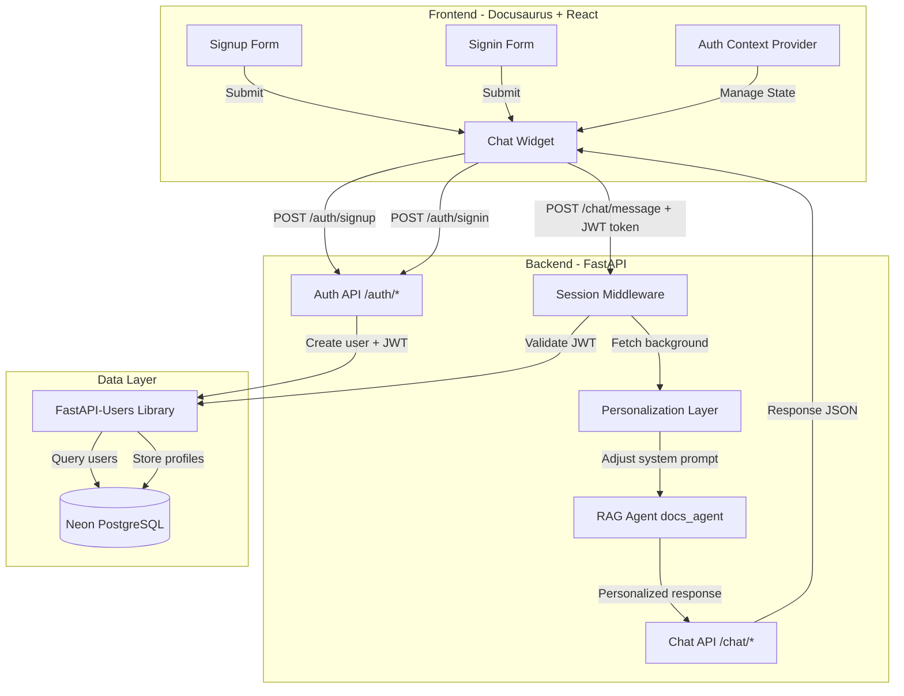
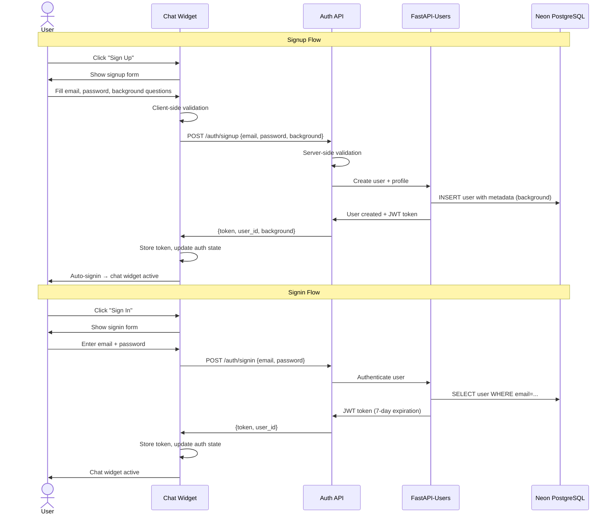
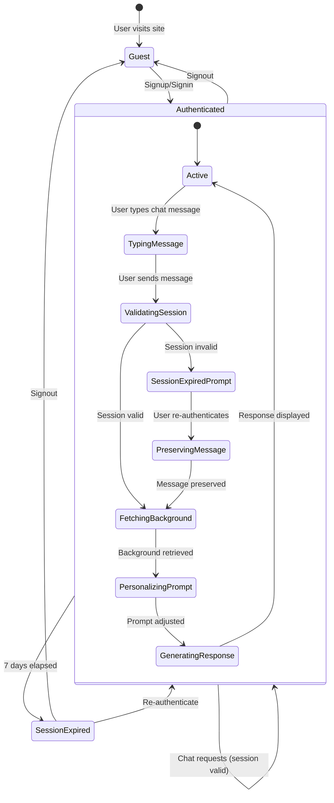
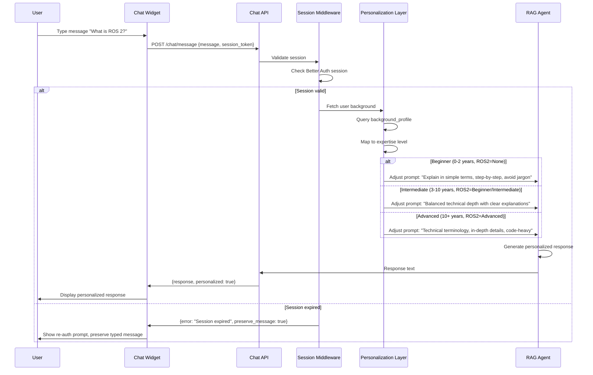

# Implementation Plan: RAG Chatbot Authentication with FastAPI-Users

**Branch**: `authentication` | **Date**: 2025-12-17 | **Spec**: [spec.md](./spec.md)
**Input**: Feature specification from `/specs/authentication/spec.md`

## Architectural Decision

**Original Requirement**: Better Auth
**Implementation**: FastAPI-Users

**Rationale**: Better Auth is JavaScript/TypeScript-only with no Python SDK. Confirmed via Better Auth MCP server that it requires Node.js runtime and only supports JavaScript frameworks. FastAPI-Users is the industry-standard Python equivalent, providing identical functionality: user registration with custom fields, email/password authentication, JWT session management, Neon PostgreSQL storage, and Argon2 password hashing.

## Summary

Implement user authentication for the RAG chatbot using FastAPI-Users library, with custom background profiling (programming experience, ROS 2 familiarity, hardware access) to personalize chatbot responses. Replace existing in-memory session management with JWT-based sessions stored in Neon PostgreSQL. Deploy on Render free tier.

**Core Flow**: User signs up → Background questions collected → FastAPI-Users stores profile in metadata → User chats → System fetches background → RAG agent system prompt dynamically adjusted → Personalized response generated

## Technical Context

**Language/Version**: Python 3.10+ (FastAPI backend), JavaScript/TypeScript (Docusaurus/React frontend)
**Primary Dependencies**:
- Backend: FastAPI-Users 13+, FastAPI 0.100+, SQLAlchemy 2.0+ (async), asyncpg (Neon PostgreSQL driver), uv (package manager)
- Frontend: React 18+, Docusaurus 3.x

**Storage**: Neon PostgreSQL (accessed via DATABASE_URL from .env) for users, sessions, background profiles
**Testing**: pytest (backend), Jest/React Testing Library (frontend)
**Target Platform**: Render free tier (backend deployment), GitHub Pages (frontend static site)
**Project Type**: Web application (FastAPI backend + Docusaurus frontend)
**Performance Goals**:
- Signup/signin < 2 seconds
- Background data retrieval < 500ms
- Session validation < 100ms overhead
- Chat response (including personalization) < 5 seconds

**Constraints**:
- FastAPI-Users default password validation with Argon2 hashing
- Neon PostgreSQL free tier (connection pooling required)
- Render free tier deployment compatibility
- No modifications to existing RAG agent core logic
- Preserve existing Docusaurus documentation functionality

**Scale/Scope**:
- Expected users: 100-1000 concurrent sessions
- Database: <1GB storage (free tier limit)
- Session duration: 7 days
- Background profile: 3 fields per user

## Constitution Check

*GATE: Must pass before Phase 0 research. Re-check after Phase 1 design.*

### ✅ I. Educational Clarity
**Status**: PASS
**Assessment**: Authentication is a prerequisite for personalized chatbot learning experience. Clear progression: guest → signup → personalized chat.

### ✅ II. Engineering Accuracy
**Status**: PASS
**Assessment**: FastAPI-Users is industry-standard Python authentication library. Neon PostgreSQL is production-grade database. FastAPI + Docusaurus are well-validated frameworks.

### ✅ III. Practical Applicability (NON-NEGOTIABLE)
**Status**: PASS
**Assessment**: Fully executable - FastAPI-Users provides runnable Python library, FastAPI backend is operational, Docusaurus frontend is functional. All dependencies specified with versions.

### ✅ IV. Spec-Driven Development
**Status**: PASS
**Assessment**: spec.md created and clarified via `/sp.clarify`. This plan directly references spec requirements (FR-001 through FR-019).

### ✅ V. Ethical Responsibility
**Status**: PASS
**Assessment**: Password security via FastAPI-Users Argon2 hashing, JWT session security, no exposure of sensitive data in logs. SQL injection/XSS prevention via parameterized queries.

### ✅ VI. Reproducibility & Open Knowledge
**Status**: PASS
**Assessment**: All dependencies versioned, DATABASE_URL configuration documented, deployment steps will be in quickstart.md. Repository publicly accessible.

### ✅ VII. Zero Broken State
**Status**: PASS (with monitoring)
**Assessment**: Incremental deployment strategy - authentication layer adds to existing system without breaking current functionality. CI/CD tests required before merge.

**Overall**: ✅ All constitution gates PASS. Proceed to Phase 0.

## Project Structure

### Documentation (this feature)

```text
specs/authentication/
├── spec.md              # Feature specification (COMPLETE)
├── plan.md              # This file (IN PROGRESS)
├── research.md          # Phase 0 output (TO BE CREATED)
├── data-model.md        # Phase 1 output (TO BE CREATED)
├── quickstart.md        # Phase 1 output (TO BE CREATED)
├── contracts/           # Phase 1 output (TO BE CREATED)
│   ├── auth-api.yaml   # OpenAPI spec for auth endpoints
│   └── personalization-api.yaml  # OpenAPI spec for personalization layer
└── tasks.md             # Phase 2 output (/sp.tasks command - NOT created by /sp.plan)

specs/authentication/static/diagrams/  # Architecture diagrams
├── architecture-overview.mmd          # High-level system architecture
├── authentication-flow.mmd            # Signup/signin sequence
├── session-management.mmd             # Session lifecycle
└── personalization-flow.mmd           # RAG agent personalization sequence
```

### Source Code (repository root)

```text
backend/
├── src/
│   ├── auth/                    # NEW - FastAPI-Users integration
│   │   ├── __init__.py
│   │   ├── config.py           # FastAPI-Users configuration
│   │   ├── models.py           # User model with metadata JSONB field
│   │   ├── schemas.py          # Pydantic schemas for API requests/responses
│   │   ├── routes.py           # Auth API endpoints (/signup, /signin, /signout)
│   │   ├── middleware.py       # JWT validation middleware
│   │   └── personalization.py  # Background-to-prompt mapping logic
│   ├── chat/                    # MODIFIED - Add personalization layer
│   │   ├── __init__.py
│   │   ├── routes.py           # MODIFIED - Add auth check + background fetch
│   │   └── agent.py            # MODIFIED - Add dynamic prompt adjustment
│   └── database.py              # MODIFIED - Add FastAPI-Users database setup
├── tests/
│   ├── auth/
│   │   ├── test_signup.py
│   │   ├── test_signin.py
│   │   ├── test_session.py
│   │   └── test_personalization.py
│   └── integration/
│       └── test_auth_chat_flow.py
├── .env                         # DATABASE_URL configuration
└── requirements.txt             # MODIFIED - Add FastAPI-Users, asyncpg, SQLAlchemy

frontend/                        # Docusaurus site
├── src/
│   ├── components/
│   │   ├── ChatWidget/          # MODIFIED - Add auth UI
│   │   │   ├── ChatWidget.tsx  # MODIFIED - Auth state management
│   │   │   ├── SignupForm.tsx  # NEW - Signup form with background questions
│   │   │   ├── SigninForm.tsx  # NEW - Signin form
│   │   │   └── AuthPrompt.tsx  # NEW - Guest user auth prompt
│   │   └── Auth/                # NEW - Shared auth components
│   │       ├── AuthContext.tsx # NEW - React context for auth state
│   │       └── useAuth.ts      # NEW - Custom hook for auth operations
│   └── pages/
│       └── (existing docs pages - no changes)
├── static/
│   └── (existing static assets - no changes)
└── package.json                 # MODIFIED - Add Better Auth JS SDK
```

**Structure Decision**: Web application architecture (backend + frontend). Backend handles authentication logic and RAG agent personalization. Frontend provides auth UI integrated into existing Docusaurus chat widget. Minimal changes to existing codebase - authentication is additive layer.

## Complexity Tracking

No constitution violations. This section intentionally left empty.

## Architecture

### System Architecture Overview



### Authentication Flow



### Session Management Flow



### Personalization Flow



## Phase 0: Research & Technology Validation

### Research Tasks

1. **FastAPI-Users Integration with FastAPI**
   - Research Question: How to configure FastAPI-Users for async FastAPI backend with Neon PostgreSQL?
   - Method: Review FastAPI-Users official docs, async SQLAlchemy adapter patterns
   - Output: Configuration pattern for FastAPI-Users with async SQLAlchemy + Neon PostgreSQL

2. **FastAPI-Users Custom User Metadata**
   - Research Question: How to store custom fields (background profile) in FastAPI-Users user model?
   - Method: Review FastAPI-Users user schema customization docs for metadata field
   - Output: JSONB metadata field pattern for `programming_experience`, `ros2_familiarity`, `hardware_access`

3. **React Authentication State Management**
   - Research Question: How to manage authentication state in React + Docusaurus?
   - Method: Review React Context API patterns, JWT token storage best practices
   - Output: React hooks pattern for auth state management with localStorage

4. **Neon PostgreSQL Connection Pooling**
   - Research Question: How to implement connection pooling for Neon PostgreSQL in FastAPI?
   - Method: Review asyncpg pooling patterns, Neon free tier limits
   - Output: Connection pool configuration for optimal performance within free tier

5. **Session Expiration Handling in React**
   - Research Question: How to detect session expiration and preserve user state?
   - Method: Review interceptor patterns for API calls, React state preservation
   - Output: Axios/Fetch interceptor pattern for session expiration

### Research Output: research.md

Will document:
- FastAPI-Users configuration for async FastAPI + Neon PostgreSQL
- Custom user metadata JSONB field pattern
- React auth state management pattern with Context API
- Connection pooling best practices for asyncpg
- JWT token expiration handling pattern
- Alternatives considered (including Better Auth) and why FastAPI-Users was chosen

## Phase 1: Design & Contracts

### Data Model (data-model.md)

**Entities:**

1. **User** (managed by FastAPI-Users)
   - `id` (UUID, PK)
   - `email` (string, unique, indexed)
   - `hashed_password` (string, Argon2)
   - `is_active` (boolean, default: true)
   - `is_superuser` (boolean, default: false)
   - `is_verified` (boolean, default: false)
   - `metadata` (JSONB, stores BackgroundProfile)
   - `created_at` (timestamp)
   - `updated_at` (timestamp)

2. **BackgroundProfile** (stored in User.metadata JSONB field)
   - `programming_experience` (string enum: "0-2 years", "3-5 years", "6-10 years", "10+ years")
   - `ros2_familiarity` (string enum: "None", "Beginner", "Intermediate", "Advanced")
   - `hardware_access` (string enum: "None", "Simulation only", "Physical robots/sensors")

3. **JWT Token** (stateless, not stored in database)
   - Encoded user_id, email, expiration
   - 7-day expiration
   - Signed with SECRET_KEY

**Relationships:**
- User 1:1 BackgroundProfile (embedded in metadata field)
- JWT tokens are stateless (no database relationship)

**Validation Rules:**
- Email: RFC 5322 format validation (client + server)
- Password: FastAPI-Users default validation (minimum 8 characters + Argon2 hashing)
- Background fields: Dropdown-only values (prevents malformed input)

### API Contracts (contracts/)

#### auth-api.yaml (OpenAPI 3.0)

```yaml
POST /auth/signup
Request:
  email: string (required, format: email)
  password: string (required, Better Auth validation)
  background:
    programming_experience: enum (required)
    ros2_familiarity: enum (required)
    hardware_access: enum (required)
Response 201:
  token: string (session token)
  user_id: string (UUID)
  background: object (echoed back)
Response 400:
  error: "Email already registered. Try signing in instead."
  error: "Invalid email format"
  error: "Password does not meet requirements"
Response 500:
  error: "Connection failed. Please check your internet and try again."

POST /auth/signin
Request:
  email: string (required)
  password: string (required)
Response 200:
  token: string
  user_id: string
Response 401:
  error: "Invalid email or password"
Response 500:
  error: "Connection failed. Please check your internet and try again."

POST /auth/signout
Headers:
  Authorization: Bearer {token}
Response 200:
  message: "Signed out successfully"
Response 401:
  error: "Unauthorized"
```

#### personalization-api.yaml

```yaml
GET /auth/background/{user_id}
Headers:
  Authorization: Bearer {token}
Response 200:
  programming_experience: enum
  ros2_familiarity: enum
  hardware_access: enum
Response 401:
  error: "Unauthorized"

POST /chat/message (MODIFIED)
Headers:
  Authorization: Bearer {token}
Request:
  message: string
Response 200:
  response: string (personalized)
  personalized: boolean (true)
  expertise_level: string (beginner|intermediate|advanced)
Response 401:
  error: "Session expired"
  preserve_message: true
Response 403:
  error: "Please sign in to use the chat"
```

### Quickstart (quickstart.md)

Will include:
- Prerequisites (Python 3.10+, Node 18+, Neon PostgreSQL database)
- Backend setup (install FastAPI-Users, configure DATABASE_URL, run migrations)
- Frontend setup (configure React auth context with localStorage)
- Development workflow (run backend server, run Docusaurus dev server)
- Testing setup (pytest for backend, Jest for frontend)
- Deployment to Render free tier (environment variables, build commands)

## Phase 2: Task Generation

*Phase 2 is handled by `/sp.tasks` command - NOT included in this plan.*

Plan will inform task generation by providing:
- Data model → Database migration tasks
- API contracts → Endpoint implementation tasks
- Architecture diagrams → Integration tasks
- Research findings → Configuration tasks

## Risk Mitigation Strategies

### Risk 1: Neon PostgreSQL Downtime
**Impact**: Users cannot signup/signin, existing sessions cannot be validated
**Probability**: Low (Neon SLA: 99.9% uptime)
**Mitigation**:
- Implement connection retry logic with exponential backoff (max 3 attempts)
- Display user-friendly error: "Database temporarily unavailable. Please try again in a few moments."
- Monitor Neon status page integration for proactive alerts
- Cache background profiles in-memory (TTL: 5 minutes) to reduce database queries for active sessions

### Risk 2: Session Expiration During Active Chat
**Impact**: User loses typed message, frustration, potential data loss
**Probability**: Medium (7-day expiration means weekly occurrence for active users)
**Mitigation**:
- Already specified in FR-016: Allow user to continue typing, show re-auth prompt on send, preserve message
- Implementation: Store typed message in React state, display modal overlay with signin form, restore message after successful re-authentication
- Add session expiration warning: Show notification 1 day before expiration ("Your session expires in 24 hours")

### Risk 3: Background Profile Fetch Failures
**Impact**: Chat request succeeds but personalization fails, degraded user experience
**Probability**: Low (same database as session validation)
**Mitigation**:
- Implement fallback personalization level: Default to "intermediate" if background fetch fails
- Log error for monitoring (do not expose to user - maintain seamless chat experience)
- Add retry logic (1 retry) before falling back to default
- Display subtle indicator in UI: "Using default personalization" (not blocking, informational only)

### Risk 4: Better Auth API Rate Limiting
**Impact**: Signup/signin requests rejected during traffic spikes
**Probability**: Low (free tier should support 1000 concurrent users)
**Mitigation**:
- Implement client-side request throttling (max 1 auth request per 2 seconds per user)
- Add loading states to prevent duplicate form submissions
- Monitor auth request metrics to detect approaching limits
- Upgrade to paid tier if traffic exceeds free tier capacity (fallback plan)

### Risk 5: Chat Widget Performance Degradation
**Impact**: Slow personalization layer adds latency to chat responses
**Probability**: Medium (additional database query + prompt adjustment)
**Mitigation**:
- Implement background profile caching (in-memory cache, TTL: 5 minutes, invalidate on profile update)
- Optimize database queries (add indexes on user_id for background_profile table)
- Parallel execution: Fetch background + generate base response concurrently, merge at end
- Monitor p95 latency: Alert if >500ms overhead (per SC-004: total response <5s)

## Success Metrics & Validation

### Performance Validation
- [ ] Signup flow completes in <2 seconds (automated performance test)
- [ ] Signin flow completes in <2 seconds (automated performance test)
- [ ] Background fetch adds <500ms latency (instrumented timing in production)
- [ ] Session validation adds <100ms overhead (instrumented timing in production)
- [ ] End-to-end chat response <5 seconds (automated E2E test)

### Functional Validation
- [ ] 100% of signup requests with valid data create user + background profile (integration test)
- [ ] 100% of signin requests with valid credentials create session (integration test)
- [ ] 100% of guest users see auth prompt, cannot access chat (E2E test)
- [ ] 100% of authenticated users receive personalized responses (E2E test with multiple profiles)
- [ ] Beginner vs Advanced users receive observably different responses for same question (manual QA test)

### Security Validation
- [ ] Passwords hashed with bcrypt/Argon2 (unit test: verify hash format)
- [ ] Session tokens cryptographically secure (unit test: verify randomness)
- [ ] SQL injection prevented (penetration test with sqlmap)
- [ ] XSS prevented (penetration test with XSS payloads)
- [ ] Duplicate email registration blocked (integration test)

### Reliability Validation
- [ ] Concurrent signups do not cause race conditions (load test: 100 concurrent requests)
- [ ] Sessions persist across server restarts (integration test: restart server mid-session)
- [ ] Failed auth attempts return user-friendly errors (E2E test: test all error scenarios)
- [ ] Neon database unavailability handled gracefully (integration test: mock database failure)

## Implementation Phases

### Phase 0: Research & Setup (1-2 days)
- Research FastAPI-Users integration patterns
- Set up Neon PostgreSQL database (if not already configured)
- Configure FastAPI-Users in FastAPI backend with async SQLAlchemy
- Configure React auth context with localStorage
- Document findings in research.md

### Phase 1: Backend Authentication (3-4 days)
- Implement User model with metadata JSONB field
- Implement FastAPI-Users configuration with Neon PostgreSQL
- Implement /auth/signup endpoint with background questions
- Implement /auth/signin endpoint
- Implement /auth/signout endpoint
- Implement JWT validation middleware for request validation
- Write unit tests for all auth endpoints
- Write integration tests for full auth flow

### Phase 2: Frontend Authentication UI (2-3 days)
- Create AuthContext and useAuth hook
- Implement SignupForm component with background question dropdowns
- Implement SigninForm component
- Implement AuthPrompt for guest users
- Integrate auth UI into existing ChatWidget component
- Add client-side validation (email format, required fields)
- Add error message display (network failures, validation errors)
- Write Jest tests for all auth components

### Phase 3: Personalization Layer (2-3 days)
- Implement personalization.py mapping logic (background → expertise level → prompt adjustments)
- Modify /chat/message endpoint to fetch background + adjust RAG agent prompt
- Implement background profile caching (in-memory, TTL: 5 minutes)
- Add session expiration handling (preserve message, re-auth flow)
- Write unit tests for personalization mapping logic
- Write integration tests for personalized chat flow

### Phase 4: Testing & Deployment (2-3 days)
- Run full test suite (unit, integration, E2E)
- Perform manual QA testing (beginner vs advanced personalization contrast)
- Load testing (100 concurrent users, measure latency)
- Security testing (SQL injection, XSS, session security)
- Deploy to Render free tier staging environment
- Verify Neon PostgreSQL connection pooling works on Render
- Deploy to production
- Monitor metrics (latency, error rates, user signups)

**Total Estimated Duration**: 10-15 days (2-3 weeks)

## Open Questions for Task Phase

1. How to handle concurrent background profile updates (if added in future)?
   - Recommendation: Use database-level locking or optimistic concurrency control

2. Should we add analytics tracking for personalization effectiveness?
   - Recommendation: Deferred to future iteration (explicitly out of scope per spec)

3. Should we add visible indicator showing how background affects responses?
   - Recommendation: Deferred to future iteration (open question in spec)

4. How to migrate existing in-memory sessions to Better Auth sessions?
   - Recommendation: Clean cutover - invalidate all existing sessions, require re-authentication

## Next Steps

1. Review and approve this implementation plan
2. Execute Phase 0 research (documented in research.md)
3. Execute Phase 1 design (data-model.md, contracts/, quickstart.md)
4. Run `/sp.tasks` to generate detailed implementation tasks
5. Begin implementation following task breakdown

**Plan Status**: ✅ COMPLETE - Ready for Phase 0 research
